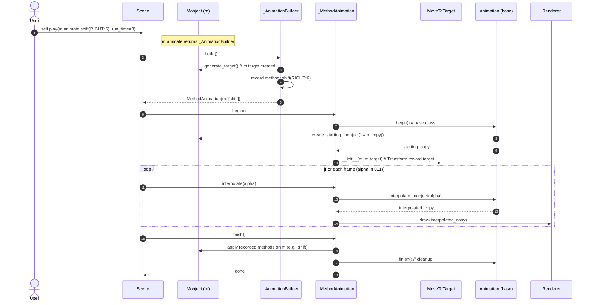

```mermaid
sequenceDiagram
    autonumber
    actor User
    participant Scene
    participant Mobject as Mobject (m)
    participant Builder as _AnimationBuilder
    participant MethodAnim as _MethodAnimation
    participant MoveToTarget
    participant Animation as Animation (base)
    participant Renderer

    User->>Scene: self.play(m.animate.shift(RIGHT*6), run_time=3)
    Note over Mobject: m.animate returns _AnimationBuilder
    Scene->>Builder: build()
    Builder->>Mobject: generate_target()  // m.target created
    Builder->>Builder: record method: shift(RIGHT*6)
    Builder-->>Scene: _MethodAnimation(m, [shift])
    Scene->>MethodAnim: begin()
    MethodAnim->>Animation: begin()  // base class
    Animation->>Mobject: create_starting_mobject() = m.copy()
    Animation-->>MethodAnim: starting_copy
    MethodAnim->>MoveToTarget: __init__(m, m.target)  // Transform toward target

    loop For each frame (alpha in 0..1)
        Scene->>MethodAnim: interpolate(alpha)
        MethodAnim->>Animation: interpolate_mobject(alpha)
        Animation-->>MethodAnim: interpolated_copy
        MethodAnim->>Renderer: draw(interpolated_copy)
    end

    Scene->>MethodAnim: finish()
    MethodAnim->>Mobject: apply recorded methods on m (e.g., shift)
    MethodAnim->>Animation: finish()  // cleanup
    MethodAnim-->>Scene: done
```
