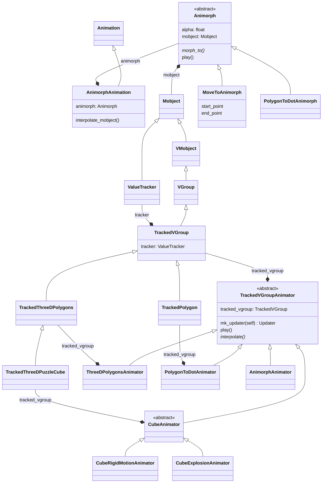

# Animators Class Diagram
*Arthur Ryman, last updated 2025-08-19*

```mermaid
classDiagram
    Animation <|-- AnimorphAnimation
    Mobject <|-- ValueTracker
    Animorph *-- Mobject  : mobject
    Animorph <|-- MoveToAnimorph
    Animorph <|-- PolygonToDotAnimorph
    Animorph --* AnimorphAnimation : animorph
    Mobject <|-- VMobject
    VMobject <|-- VGroup
    VGroup <|-- TrackedVGroup
    ValueTracker --* TrackedVGroup : tracker
    TrackedVGroup <|-- TrackedPolygon
    TrackedVGroup <|-- TrackedThreeDPolygons

    TrackedThreeDPolygons <|-- TrackedThreeDPuzzleCube

    TrackedVGroup --* TrackedVGroupAnimator : tracked_vgroup
    TrackedVGroupAnimator <|-- CubeAnimator
    TrackedThreeDPuzzleCube --* CubeAnimator : tracked_vgroup
    CubeAnimator <|-- CubeRigidMotionAnimator
    CubeAnimator <|-- CubeExplosionAnimator
    TrackedVGroupAnimator <|-- ThreeDPolygonsAnimator
    TrackedThreeDPolygons --* ThreeDPolygonsAnimator : tracked_vgroup
    TrackedVGroupAnimator <|-- PolygonToDotAnimator
    TrackedPolygon --* PolygonToDotAnimator : tracked_vgroup
    TrackedVGroupAnimator <|-- AnimorphAnimator
    
    class Animorph {
        alpha: float
        mobject: Mobject
        morph_to()*
        play()
    }
    <<abstract>> Animorph
    
    class MoveToAnimorph {
        start_point
        end_point
    }

    class TrackedVGroup {
        tracker: ValueTracker
    }
    
    class AnimorphAnimation {
        animorph: Animorph
        interpolate_mobject()
    }
    class TrackedVGroupAnimator {
        tracked_vgroup: TrackedVGroup
        mk_updater(self) Updater 
        play()
        interpolate()*
    }
    <<abstract>> TrackedVGroupAnimator
    <<abstract>> CubeAnimator
```