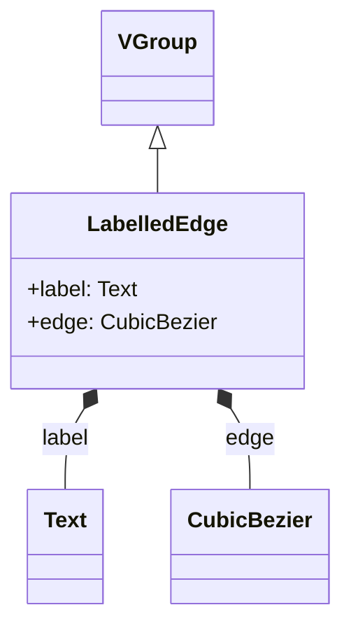

# LabelledEdge
*Arthur Ryman, last updated 2025-08-11*

I need labelled edges in the opposite-face graph.
I have decided to create a new `LabelledEdge` class that subclasses Manim `VGroup`.
ChatGPT generated the following mermaid code which renders nicely in PyCharm after you
install the Mermaid plugin. GitHub also renders it correctly.

