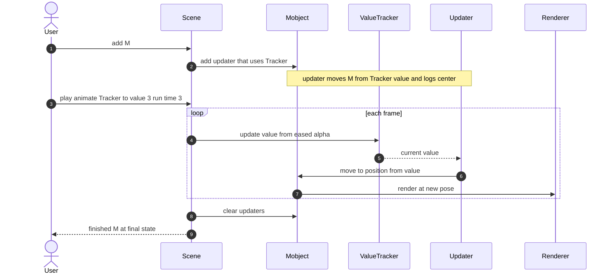

```mermaid
sequenceDiagram
    autonumber
    actor User
    participant Scene
    participant M as Mobject
    participant Tracker as ValueTracker
    participant Updater
    participant Renderer

    User->>Scene: add M
    Scene->>M: add updater that uses Tracker
    Note over Updater,M: updater moves M from Tracker value and logs center

    User->>Scene: play animate Tracker to value 3 run time 3

    loop each frame
        Scene->>Tracker: update value from eased alpha
        Tracker-->>Updater: current value
        Updater->>M: move to position from value
        M->>Renderer: render at new pose
    end

    Scene->>M: clear updaters
    Scene-->>User: finished M at final state
```
